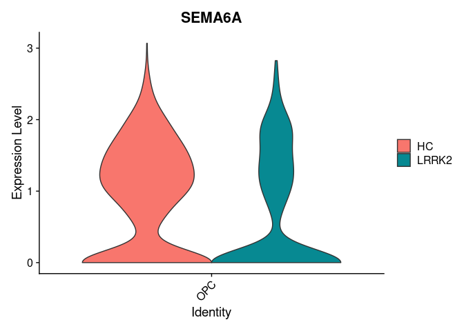
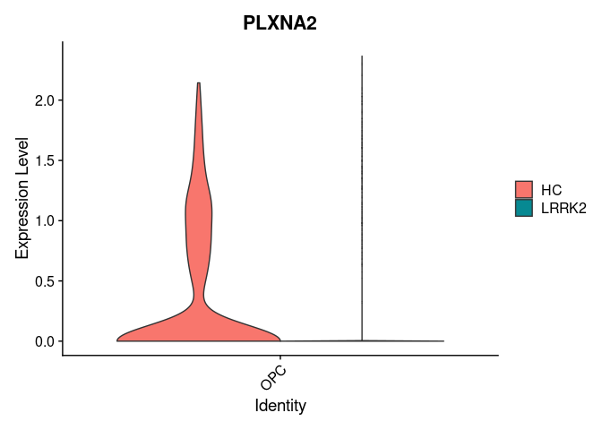

snRNA_seq_Manuscript_Fig7
================
2024-09-06

- [Command for cellranger pipeline](#command-for-cellranger-pipeline)
- [Load libraries](#load-libraries)
- [Load the RNA-Seq data](#load-the-rna-seq-data)
- [Figure 6-E : SEMA6A and PLXNA2 Violin
  Plots](#figure-6-e--sema6a-and-plxna2-violin-plots)

## Command for cellranger pipeline

cd /mnt/md0/Nasser/20084I_0552_Mo_snRNA &&
/mnt/md0/MultiOmics/Tools/Nasser/cellranger-8.0.0/cellranger count
–id=20084a001_02
–transcriptome=/mnt/md0/MultiOmics/Database/Nasser/refdata-gex-GRCh38-2024-A
–fastqs=/mnt/md0/Mohammad/20084I_0552_Mohammad_nuclei/Sample_20084a001_02/
–sample=20084a001_02 –create-bam=true \> 20084a001_02.err

cd /mnt/md0/Nasser/20084I_0552_Mo_snRNA &&
/mnt/md0/MultiOmics/Tools/Nasser/cellranger-8.0.0/cellranger count
–id=20084a002_02
–transcriptome=/mnt/md0/MultiOmics/Database/Nasser/refdata-gex-GRCh38-2024-A
–fastqs=/mnt/md0/Mohammad/20084I_0552_Mohammad_nuclei/Sample_20084a002_02/
–sample=20084a002_02 –create-bam=true \> 20084a002_02.err

cd /mnt/md0/Nasser/20084I_0552_Mo_snRNA &&
/mnt/md0/MultiOmics/Tools/Nasser/cellranger-8.0.0/cellranger count
–id=20084a003_02
–transcriptome=/mnt/md0/MultiOmics/Database/Nasser/refdata-gex-GRCh38-2024-A
–fastqs=/mnt/md0/Mohammad/20084I_0552_Mohammad_nuclei/Sample_20084a003_02/
–sample=20084a003_02 –create-bam=true \> 20084a003_02.err

cd /mnt/md0/Nasser/20084I_0552_Mo_snRNA &&
/mnt/md0/MultiOmics/Tools/Nasser/cellranger-8.0.0/cellranger count
–id=20084a004_02
–transcriptome=/mnt/md0/MultiOmics/Database/Nasser/refdata-gex-GRCh38-2024-A
–fastqs=/mnt/md0/Mohammad/20084I_0552_Mohammad_nuclei/Sample_20084a004_02/
–sample=20084a004_02 –create-bam=true \> 20084a004_02.err

cd /mnt/md0/Nasser/20084I_0552_Mo_snRNA &&
/mnt/md0/MultiOmics/Tools/Nasser/cellranger-8.0.0/cellranger count
–id=20084a005_01
–transcriptome=/mnt/md0/MultiOmics/Database/Nasser/refdata-gex-GRCh38-2024-A
–fastqs=/mnt/md0/Mohammad/20084I_0552_Mohammad_nuclei/Sample_20084a005_01/
–sample=20084a005_01 –create-bam=true \> 20084a005_01.err

cd /mnt/md0/Nasser/20084I_0552_Mo_snRNA &&
/mnt/md0/MultiOmics/Tools/Nasser/cellranger-8.0.0/cellranger count
–id=20084a006_01
–transcriptome=/mnt/md0/MultiOmics/Database/Nasser/refdata-gex-GRCh38-2024-A
–fastqs=/mnt/md0/Mohammad/20084I_0552_Mohammad_nuclei/Sample_20084a006_01/
–sample=20084a006_01 –create-bam=true \> 20084a006_01.err

cd /mnt/md0/Nasser/20084I_0552_Mo_snRNA &&
/mnt/md0/MultiOmics/Tools/Nasser/cellranger-8.0.0/cellranger count
–id=20084a007_01
–transcriptome=/mnt/md0/MultiOmics/Database/Nasser/refdata-gex-GRCh38-2024-A
–fastqs=/mnt/md0/Mohammad/20084I_0552_Mohammad_nuclei/Sample_20084a007_01/
–sample=20084a007_01 –create-bam=true \> 20084a007_01.err

cd /mnt/md0/Nasser/20084I_0552_Mo_snRNA &&
/mnt/md0/MultiOmics/Tools/Nasser/cellranger-8.0.0/cellranger count
–id=20084a008_01
–transcriptome=/mnt/md0/MultiOmics/Database/Nasser/refdata-gex-GRCh38-2024-A
–fastqs=/mnt/md0/Mohammad/20084I_0552_Mohammad_nuclei/Sample_20084a008_01/
–sample=20084a008_01 –create-bam=true \> 20084a008_01.err

cd /mnt/md0/Nasser/20084I_0552_Mo_snRNA &&
/mnt/md0/MultiOmics/Tools/Nasser/cellranger-8.0.0/cellranger count
–id=20084a009_04
–transcriptome=/mnt/md0/MultiOmics/Database/Nasser/refdata-gex-GRCh38-2024-A
–fastqs=/mnt/md0/Mohammad/20084I_0552_Mohammad_nuclei/Sample_20084a009_04/
–sample=20084a009_04 –create-bam=true \> 20084a009_04.err

cd /mnt/md0/Nasser/20084I_0552_Mo_snRNA &&
/mnt/md0/MultiOmics/Tools/Nasser/cellranger-8.0.0/cellranger count
–id=20084a010_04
–transcriptome=/mnt/md0/MultiOmics/Database/Nasser/refdata-gex-GRCh38-2024-A
–fastqs=/mnt/md0/Mohammad/20084I_0552_Mohammad_nuclei/Sample_20084a010_04/
–sample=20084a010_04 –create-bam=true \> 20084a010_04.err

cd /mnt/md0/Nasser/20084I_0552_Mo_snRNA &&
/mnt/md0/MultiOmics/Tools/Nasser/cellranger-8.0.0/cellranger count
–id=20084a011_03
–transcriptome=/mnt/md0/MultiOmics/Database/Nasser/refdata-gex-GRCh38-2024-A
–fastqs=/mnt/md0/Mohammad/20084I_0552_Mohammad_nuclei/Sample_20084a011_03/
–sample=20084a011_03 –create-bam=true \> 20084a011_03.err

cd /mnt/md0/Nasser/20084I_0552_Mo_snRNA &&
/mnt/md0/MultiOmics/Tools/Nasser/cellranger-8.0.0/cellranger count
–id=20084a012_01
–transcriptome=/mnt/md0/MultiOmics/Database/Nasser/refdata-gex-GRCh38-2024-A
–fastqs=/mnt/md0/Mohammad/20084I_0552_Mohammad_nuclei/Sample_20084a012_01/
–sample=20084a012_01 –create-bam=true \> 20084a012_01.err

## Load libraries

``` r
# Load necessary libraries
.libPaths( c( "/data/Common_Folder/R/Single_cell_packages/", .libPaths()) )
library(Seurat)
library(dplyr)
library(ggplot2)
library(envalysis)
library(ggrepel)
```

## Load the RNA-Seq data

``` r
# Assuming 'pd' is your Seurat object
pd <- readRDS("/data/nasser/snRNA_seq/OutputObjects/snRNAseq_GSE272760_reanalysis_postmortemBrain.rds")
#pd <- readRDS("/data/nasser/Dehestani_etal_Oligo_seuratobj.rds")
DefaultAssay(pd) <- "RNA"

pd <- NormalizeData(pd)
```

    ## Normalizing layer: counts

``` r
pd = ScaleData(pd)
```

    ## Centering and scaling data matrix

## Figure 6-E : SEMA6A and PLXNA2 Violin Plots

You can also embed plots, for example:

``` r
Idents(pd) <- "Mutation"

celltype_subset <- subset(pd, idents = c("HC", "LRRK2"))
levels(celltype_subset) <- c("HC", "LRRK2")

Idents(celltype_subset) <- "BroadCellType"


#png(file = "/data/nasser/snRNA_seq/vlnplot_opc_sema6a.png", width=2000, height=2000, res = 300)
VlnPlot(celltype_subset, features = c("SEMA6A"), idents = "OPC", split.by = "Mutation",pt.size = 0 ) 
```

    ## The default behaviour of split.by has changed.
    ## Separate violin plots are now plotted side-by-side.
    ## To restore the old behaviour of a single split violin,
    ## set split.plot = TRUE.
    ##       
    ## This message will be shown once per session.

<!-- -->

``` r
#dev.off()

#png(file = "/data/nasser/snRNA_seq/vlnplot_opc_plxna2.png", width=2000, height=2000, res = 300)
VlnPlot(celltype_subset, features = c("PLXNA2"), idents = "OPC", split.by = "Mutation",pt.size = 0 )
```

<!-- -->

``` r
#dev.off()
```
