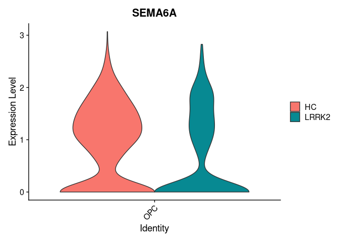
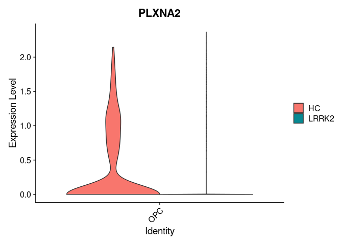

snRNA_seq_Manuscript_Fig7
================
2024-09-06

- [Command for cellranger pipeline](#command-for-cellranger-pipeline)
- [Load libraries](#load-libraries)
- [create Seurat object](#create-seurat-object)
- [Preprocessing of object](#preprocessing-of-object)
- [Load the RNA-Seq data](#load-the-rna-seq-data)
- [Figure 6-E : SEMA6A and PLXNA2 Violin
  Plots](#figure-6-e--sema6a-and-plxna2-violin-plots)

## Command for cellranger pipeline

cd /mnt/md0/Nasser/20084I_0552_Mo_snRNA &&
/mnt/md0/MultiOmics/Tools/Nasser/cellranger-8.0.0/cellranger count
–id=20084a001_02
–transcriptome=/mnt/md0/MultiOmics/Database/Nasser/refdata-gex-GRCh38-2024-A
–fastqs=/mnt/md0/Mohammad/20084I_0552_Mohammad_nuclei/Sample_20084a001_02/
–sample=20084a001_02 –create-bam=true \> 20084a001_02.err

cd /mnt/md0/Nasser/20084I_0552_Mo_snRNA &&
/mnt/md0/MultiOmics/Tools/Nasser/cellranger-8.0.0/cellranger count
–id=20084a002_02
–transcriptome=/mnt/md0/MultiOmics/Database/Nasser/refdata-gex-GRCh38-2024-A
–fastqs=/mnt/md0/Mohammad/20084I_0552_Mohammad_nuclei/Sample_20084a002_02/
–sample=20084a002_02 –create-bam=true \> 20084a002_02.err

cd /mnt/md0/Nasser/20084I_0552_Mo_snRNA &&
/mnt/md0/MultiOmics/Tools/Nasser/cellranger-8.0.0/cellranger count
–id=20084a003_02
–transcriptome=/mnt/md0/MultiOmics/Database/Nasser/refdata-gex-GRCh38-2024-A
–fastqs=/mnt/md0/Mohammad/20084I_0552_Mohammad_nuclei/Sample_20084a003_02/
–sample=20084a003_02 –create-bam=true \> 20084a003_02.err

cd /mnt/md0/Nasser/20084I_0552_Mo_snRNA &&
/mnt/md0/MultiOmics/Tools/Nasser/cellranger-8.0.0/cellranger count
–id=20084a004_02
–transcriptome=/mnt/md0/MultiOmics/Database/Nasser/refdata-gex-GRCh38-2024-A
–fastqs=/mnt/md0/Mohammad/20084I_0552_Mohammad_nuclei/Sample_20084a004_02/
–sample=20084a004_02 –create-bam=true \> 20084a004_02.err

cd /mnt/md0/Nasser/20084I_0552_Mo_snRNA &&
/mnt/md0/MultiOmics/Tools/Nasser/cellranger-8.0.0/cellranger count
–id=20084a005_01
–transcriptome=/mnt/md0/MultiOmics/Database/Nasser/refdata-gex-GRCh38-2024-A
–fastqs=/mnt/md0/Mohammad/20084I_0552_Mohammad_nuclei/Sample_20084a005_01/
–sample=20084a005_01 –create-bam=true \> 20084a005_01.err

cd /mnt/md0/Nasser/20084I_0552_Mo_snRNA &&
/mnt/md0/MultiOmics/Tools/Nasser/cellranger-8.0.0/cellranger count
–id=20084a006_01
–transcriptome=/mnt/md0/MultiOmics/Database/Nasser/refdata-gex-GRCh38-2024-A
–fastqs=/mnt/md0/Mohammad/20084I_0552_Mohammad_nuclei/Sample_20084a006_01/
–sample=20084a006_01 –create-bam=true \> 20084a006_01.err

cd /mnt/md0/Nasser/20084I_0552_Mo_snRNA &&
/mnt/md0/MultiOmics/Tools/Nasser/cellranger-8.0.0/cellranger count
–id=20084a007_01
–transcriptome=/mnt/md0/MultiOmics/Database/Nasser/refdata-gex-GRCh38-2024-A
–fastqs=/mnt/md0/Mohammad/20084I_0552_Mohammad_nuclei/Sample_20084a007_01/
–sample=20084a007_01 –create-bam=true \> 20084a007_01.err

cd /mnt/md0/Nasser/20084I_0552_Mo_snRNA &&
/mnt/md0/MultiOmics/Tools/Nasser/cellranger-8.0.0/cellranger count
–id=20084a008_01
–transcriptome=/mnt/md0/MultiOmics/Database/Nasser/refdata-gex-GRCh38-2024-A
–fastqs=/mnt/md0/Mohammad/20084I_0552_Mohammad_nuclei/Sample_20084a008_01/
–sample=20084a008_01 –create-bam=true \> 20084a008_01.err

cd /mnt/md0/Nasser/20084I_0552_Mo_snRNA &&
/mnt/md0/MultiOmics/Tools/Nasser/cellranger-8.0.0/cellranger count
–id=20084a009_04
–transcriptome=/mnt/md0/MultiOmics/Database/Nasser/refdata-gex-GRCh38-2024-A
–fastqs=/mnt/md0/Mohammad/20084I_0552_Mohammad_nuclei/Sample_20084a009_04/
–sample=20084a009_04 –create-bam=true \> 20084a009_04.err

cd /mnt/md0/Nasser/20084I_0552_Mo_snRNA &&
/mnt/md0/MultiOmics/Tools/Nasser/cellranger-8.0.0/cellranger count
–id=20084a010_04
–transcriptome=/mnt/md0/MultiOmics/Database/Nasser/refdata-gex-GRCh38-2024-A
–fastqs=/mnt/md0/Mohammad/20084I_0552_Mohammad_nuclei/Sample_20084a010_04/
–sample=20084a010_04 –create-bam=true \> 20084a010_04.err

cd /mnt/md0/Nasser/20084I_0552_Mo_snRNA &&
/mnt/md0/MultiOmics/Tools/Nasser/cellranger-8.0.0/cellranger count
–id=20084a011_03
–transcriptome=/mnt/md0/MultiOmics/Database/Nasser/refdata-gex-GRCh38-2024-A
–fastqs=/mnt/md0/Mohammad/20084I_0552_Mohammad_nuclei/Sample_20084a011_03/
–sample=20084a011_03 –create-bam=true \> 20084a011_03.err

cd /mnt/md0/Nasser/20084I_0552_Mo_snRNA &&
/mnt/md0/MultiOmics/Tools/Nasser/cellranger-8.0.0/cellranger count
–id=20084a012_01
–transcriptome=/mnt/md0/MultiOmics/Database/Nasser/refdata-gex-GRCh38-2024-A
–fastqs=/mnt/md0/Mohammad/20084I_0552_Mohammad_nuclei/Sample_20084a012_01/
–sample=20084a012_01 –create-bam=true \> 20084a012_01.err

## Load libraries

``` r
# Load necessary libraries
.libPaths( c( "/data/Common_Folder/R/Single_cell_packages/", .libPaths()) )
library(Seurat)
library(dplyr)
library(ggplot2)
library(envalysis)
library(ggrepel)
```

## create Seurat object

``` r
# Function to create Seurat object from directory
createSeuratObjectFromDir <- function(dir) {
  data <- Read10X(data.dir = dir)
  return(CreateSeuratObject(counts = data, min.cells = 3, min.features = 200))
}

# Create Seurat objects for each sample
s1 <- createSeuratObjectFromDir("/data/nasser/snRNA_seq/Counts/20084a001_02/filtered_feature_bc_matrix/")
s2 <- createSeuratObjectFromDir("/data/nasser/snRNA_seq/Counts/20084a002_02/filtered_feature_bc_matrix/")
s3 <- createSeuratObjectFromDir("/data/nasser/snRNA_seq/Counts/20084a003_02/filtered_feature_bc_matrix/")
s4 <- createSeuratObjectFromDir("/data/nasser/snRNA_seq/Counts/20084a004_02/filtered_feature_bc_matrix/")
s5 <- createSeuratObjectFromDir("/data/nasser/snRNA_seq/Counts/20084a005_01/filtered_feature_bc_matrix/")
s6 <- createSeuratObjectFromDir("/data/nasser/snRNA_seq/Counts/20084a006_01/filtered_feature_bc_matrix/")
s7 <- createSeuratObjectFromDir("/data/nasser/snRNA_seq/Counts/20084a007_01/filtered_feature_bc_matrix/")
s8 <- createSeuratObjectFromDir("/data/nasser/snRNA_seq/Counts/20084a008_01/filtered_feature_bc_matrix/")
s9 <- createSeuratObjectFromDir("/data/nasser/snRNA_seq/Counts/20084a009_04/filtered_feature_bc_matrix/")
s10 <- createSeuratObjectFromDir("/data/nasser/snRNA_seq/Counts/20084a010_04/filtered_feature_bc_matrix/")
s11 <- createSeuratObjectFromDir("/data/nasser/snRNA_seq/Counts/20084a011_03/filtered_feature_bc_matrix/")
s12 <- createSeuratObjectFromDir("/data/nasser/snRNA_seq/Counts/20084a012_01/filtered_feature_bc_matrix/")


#Add metadata info
s1@meta.data$Mutation <- "GBA1_L"
s1@meta.data$SampleID <- "s1"
s1@meta.data$Region <- "PFC"


s2@meta.data$Mutation <- "GBA1_L"
s2@meta.data$SampleID <- "s2"
s2@meta.data$Region <- "ACC"


s3@meta.data$Mutation <- "LRRK2"
s3@meta.data$SampleID <- "s3"
s3@meta.data$Region <- "PFC"

s4@meta.data$Mutation <- "LRRK2"
s4@meta.data$SampleID <- "s4"
s4@meta.data$Region <- "ACC"

s5@meta.data$Mutation <- "GBA1_E"
s5@meta.data$SampleID <- "s5"
s5@meta.data$Region <- "PFC"


s6@meta.data$Mutation <- "GBA1_E"
s6@meta.data$SampleID <- "s6"
s6@meta.data$Region <- "ACC"

s7@meta.data$Mutation <- "HC"
s7@meta.data$SampleID <- "s7"
s7@meta.data$Region <- "PFC"

s8@meta.data$Mutation <- "HC"
s8@meta.data$SampleID <- "s8"
s8@meta.data$Region <- "ACC"

s9@meta.data$Mutation <- "LRRK2"
s9@meta.data$SampleID <- "s9"
s9@meta.data$Region <- "PFC"

s10@meta.data$Mutation <- "LRRK2"
s10@meta.data$SampleID <- "s10"
s10@meta.data$Region <- "ACC"

s11@meta.data$Mutation <- "HC"
s11@meta.data$SampleID <- "s11"
s11@meta.data$Region <- "PFC"

s12@meta.data$Mutation <- "HC"
s12@meta.data$SampleID <- "s12"
s12@meta.data$Region <- "ACC"

# Merge Seurat objects
pd <- merge(s1, y = c(s2, s3, s4, s5, s6, s7, s8,s9,s10,s11,s12), add.cell.ids = c("GBA1_L", "GBA1_L", "LRRK2", "LRRK2", "GBA1_E", "GBA1_E", "HC",  "HC","LRRK2", "LRRK2", "HC",  "HC"), merge.data = TRUE, project = "All")
#pd <- merge(s1, y = c(s2, s3, s4, s5, s6, s7, s8,s9,s10,s11,s12), merge.data = TRUE, project = "All")
pd
```

## Preprocessing of object

``` r
pd[["percent.mt"]] <- PercentageFeatureSet(pd, pattern = "^MT-")
pd <- subset(pd, subset = nFeature_RNA > 1000 & nFeature_RNA < 10000 & percent.mt < 10)
#preprocessing

pd <- SCTransform(object = pd)
pd <- RunPCA(pd)


pd <- IntegrateLayers(object = pd, method = HarmonyIntegration,
                       orig.reduction = "pca", new.reduction = 'harmony',
                       assay = "SCT", verbose = T)

# re-join layers after integration
pd[["RNA"]] <- JoinLayers(pd[["RNA"]])

DefaultAssay(pd) <- "SCT"

pd <- FindNeighbors(pd, reduction = "harmony", dims = 1:30)
pd <- FindClusters(pd, resolution = 0.1)
pd <- RunUMAP(pd, dims = 1:30, reduction = "harmony")

#normalise and scale object for RNA assay
DefaultAssay(pd) <- "RNA"
pd <- NormalizeData(pd)
pd = ScaleData(pd)

# Assign cell type names to clusters
Idents(pd) <- "seurat_clusters"

new.cluster.ids <- c("ODC","ExN", "Astro", "InN", "OPC", "MG", "ExN", "ExN", "InN", "ExN", "ExN", "ExN", "InN", "Vas", "ExN", "ODC", "ODC", "InN", "ExN")

names(new.cluster.ids) <- levels(pd)
pd <- RenameIdents(pd, new.cluster.ids)
pd@meta.data$BroadCellType <- as.character(Idents(pd))

#object saved as snRNAseq_GSE272760_reanalysis_postmortemBrain.rds
```

## Load the RNA-Seq data

``` r
# Assuming 'pd' is your Seurat object
pd <- readRDS("/data/nasser/snRNA_seq/OutputObjects/snRNAseq_GSE272760_reanalysis_postmortemBrain.rds")
#pd <- readRDS("/data/nasser/Dehestani_etal_Oligo_seuratobj.rds")
DefaultAssay(pd) <- "RNA"

pd <- NormalizeData(pd)
```

    ## Normalizing layer: counts

``` r
pd = ScaleData(pd)
```

    ## Centering and scaling data matrix

## Figure 6-E : SEMA6A and PLXNA2 Violin Plots

You can also embed plots, for example:

``` r
Idents(pd) <- "Mutation"

celltype_subset <- subset(pd, idents = c("HC", "LRRK2"))
levels(celltype_subset) <- c("HC", "LRRK2")

Idents(celltype_subset) <- "BroadCellType"


#png(file = "/data/nasser/snRNA_seq/vlnplot_opc_sema6a.png", width=2000, height=2000, res = 300)
VlnPlot(celltype_subset, features = c("SEMA6A"), idents = "OPC", split.by = "Mutation",pt.size = 0 ) 
```

    ## The default behaviour of split.by has changed.
    ## Separate violin plots are now plotted side-by-side.
    ## To restore the old behaviour of a single split violin,
    ## set split.plot = TRUE.
    ##       
    ## This message will be shown once per session.

<!-- -->

``` r
#dev.off()

#png(file = "/data/nasser/snRNA_seq/vlnplot_opc_plxna2.png", width=2000, height=2000, res = 300)
VlnPlot(celltype_subset, features = c("PLXNA2"), idents = "OPC", split.by = "Mutation",pt.size = 0 )
```

<!-- -->

``` r
#dev.off()
```
