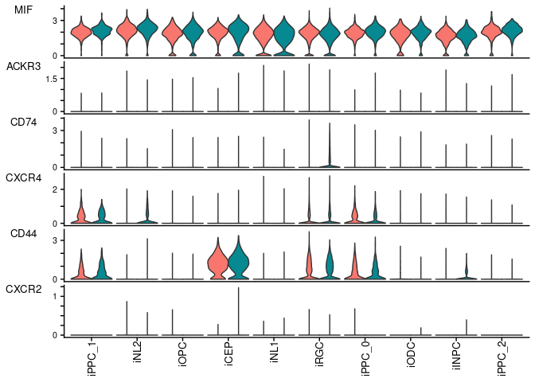
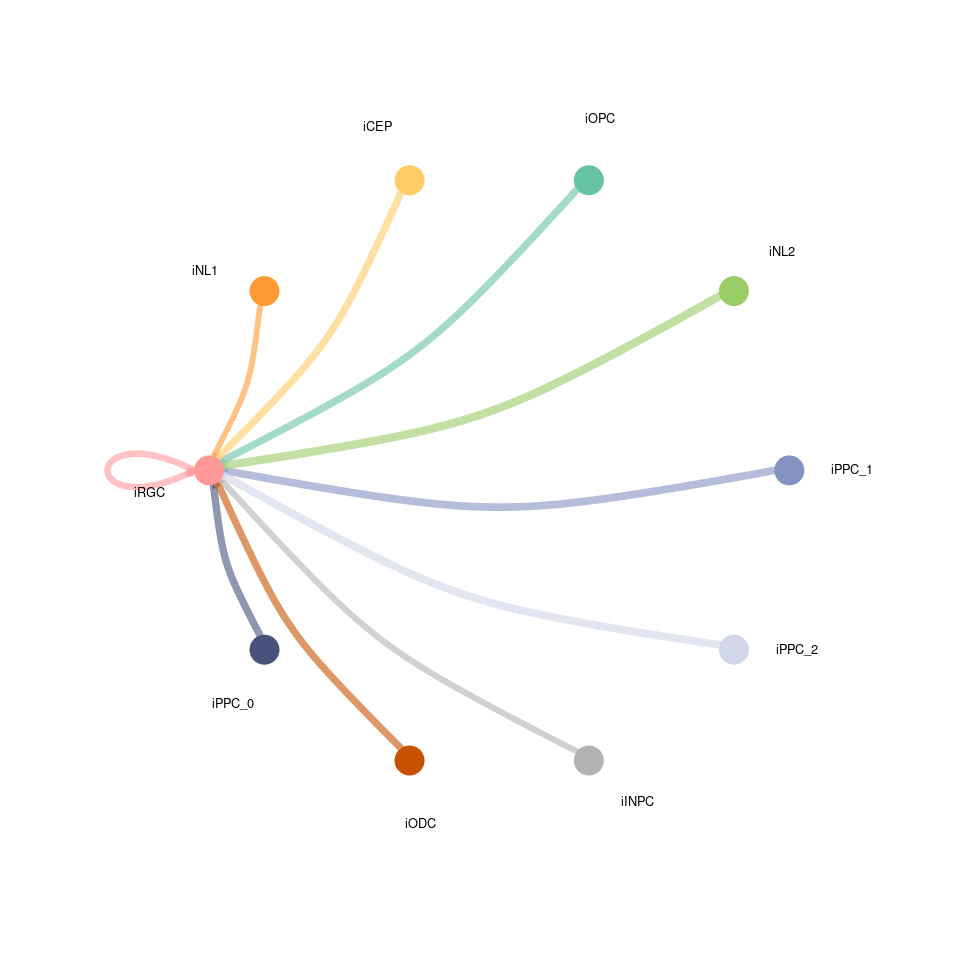

Figure cellchat
================

- [Load Data](#load-data)
- [Subset Data HC](#subset-data-hc)
- [Create CellChat Object HC](#create-cellchat-object-hc)
- [Subset and Preprocess Data HC](#subset-and-preprocess-data-hc)
- [Compute Communication Probability
  HC](#compute-communication-probability-hc)
- [Subset Data LRRK2](#subset-data-lrrk2)
- [Create CellChat Object LRRK2](#create-cellchat-object-lrrk2)
- [Subset and Preprocess Data LRRK2](#subset-and-preprocess-data-lrrk2)
- [Compute Communication Probability
  LRRK2](#compute-communication-probability-lrrk2)
- [Compare Interactions](#compare-interactions)
- [Figure 5-A: Relative Information
  Flow](#figure-5-a-relative-information-flow)
- [Pathways Analysis](#pathways-analysis)
- [Figure 5-B: PSAP Information Flow
  Visualization](#figure-5-b-psap-information-flow-visualization)
- [MIF Gene Expression](#mif-gene-expression)
- [Figure 5-C: MIF Information Flow
  Visualization](#figure-5-c-mif-information-flow-visualization)
- [Figure 5-D: SEMA6 Information Flow
  Visualization](#figure-5-d-sema6-information-flow-visualization)
- [Selected Overall Gene Expression](#selected-overall-gene-expression)

``` r
.libPaths( c( "/data/Common_Folder/R/Single_cell_packages/", .libPaths()) )

library(CellChat)
library(patchwork)
library(Seurat)
options(stringsAsFactors = FALSE)
```

## Load Data

## Subset Data HC

``` r
Idents(sSubCluster2) <- "Mutation"
sSubCluster2HC <- subset(sSubCluster2, idents = "HC")
Idents(sSubCluster2HC) <- "CellType"
sSubCluster2HC_100Cells <- sSubCluster2HC

data.input <- sSubCluster2HC_100Cells[["RNA"]]$data
labels <- Idents(sSubCluster2HC_100Cells)

# create a dataframe of the cell labels
meta <- data.frame(labels = labels, row.names = names(labels)) 
```

## Create CellChat Object HC

``` r
colnames(sSubCluster2HC_100Cells@meta.data)[8] <- "samples"
cellchat <- createCellChat(object = sSubCluster2HC_100Cells, group.by = "ident", assay = "RNA")
```

    ## [1] "Create a CellChat object from a Seurat object"
    ## The `meta.data` slot in the Seurat object is used as cell meta information 
    ## Set cell identities for the new CellChat object 
    ## The cell groups used for CellChat analysis are  iNL1, iPPC_2, iNL2, iINPC, iRGC, iODC, iCEP, iPPC_0, iPPC_1, iOPC

``` r
CellChatDB <- CellChatDB.human # use CellChatDB.mouse if running on mouse data
showDatabaseCategory(CellChatDB)
```

<!-- -->

## Subset and Preprocess Data HC

``` r
CellChatDB.use <- subsetDB(CellChatDB)
cellchat@DB <- CellChatDB.use
cellchat <- subsetData(cellchat) # This step is necessary even if using the whole database
future::plan("sequential") 
cellchat <- identifyOverExpressedGenes(cellchat)
cellchat <- identifyOverExpressedInteractions(cellchat)
```

    ## The number of highly variable ligand-receptor pairs used for signaling inference is 1765

## Compute Communication Probability HC

``` r
cellchat <- computeCommunProb(cellchat, type = "triMean", nboot=100)
```

    ## triMean is used for calculating the average gene expression per cell group. 
    ## [1] ">>> Run CellChat on sc/snRNA-seq data <<< [2024-08-08 10:10:43.05373]"
    ## [1] ">>> CellChat inference is done. Parameter values are stored in `object@options$parameter` <<< [2024-08-08 10:16:54.622436]"

``` r
cellchat <- filterCommunication(cellchat, min.cells = 50)
cellchat <- computeCommunProbPathway(cellchat)
cellchat <- aggregateNet(cellchat)
cellchat <- netAnalysis_computeCentrality(cellchat, slot.name = "netP") 
cellchatHC <- cellchat
#saveRDS(cellchat, file = "cellchat_ODC_HC.rds")
cellchatHC
```

    ## An object of class CellChat created from a single dataset 
    ##  32969 genes.
    ##  17059 cells. 
    ## CellChat analysis of single cell RNA-seq data!

## Subset Data LRRK2

``` r
Idents(sSubCluster2) <- "Mutation"
sSubCluster2LRRK2 <- subset(sSubCluster2, idents = "LRRK2")
Idents(sSubCluster2LRRK2) <- "CellType"
sSubCluster2LRRK2_100Cells <- sSubCluster2LRRK2

data.input <- sSubCluster2LRRK2_100Cells[["RNA"]]$data
labels <- Idents(sSubCluster2LRRK2_100Cells)
meta <- data.frame(labels = labels, row.names = names(labels)) # create a dataframe of the cell labels
```

## Create CellChat Object LRRK2

``` r
colnames(sSubCluster2LRRK2_100Cells@meta.data)[8] <- "samples"
cellchat <- createCellChat(object = sSubCluster2LRRK2_100Cells, group.by = "ident", assay = "RNA")
```

    ## [1] "Create a CellChat object from a Seurat object"
    ## The `meta.data` slot in the Seurat object is used as cell meta information 
    ## Set cell identities for the new CellChat object 
    ## The cell groups used for CellChat analysis are  iPPC_1, iNL2, iOPC, iCEP, iNL1, iRGC, iPPC_0, iODC, iINPC, iPPC_2

``` r
CellChatDB <- CellChatDB.human # use CellChatDB.mouse if running on mouse data
showDatabaseCategory(CellChatDB)
```

<!-- -->

## Subset and Preprocess Data LRRK2

``` r
CellChatDB.use <- subsetDB(CellChatDB)
cellchat@DB <- CellChatDB.use
cellchat <- subsetData(cellchat) # This step is necessary even if using the whole database
future::plan("sequential") 
cellchat <- identifyOverExpressedGenes(cellchat)
cellchat <- identifyOverExpressedInteractions(cellchat)
```

    ## The number of highly variable ligand-receptor pairs used for signaling inference is 1650

## Compute Communication Probability LRRK2

``` r
cellchat <- computeCommunProb(cellchat, type = "triMean", nboot=100)
```

    ## triMean is used for calculating the average gene expression per cell group. 
    ## [1] ">>> Run CellChat on sc/snRNA-seq data <<< [2024-08-08 10:17:09.561765]"
    ## [1] ">>> CellChat inference is done. Parameter values are stored in `object@options$parameter` <<< [2024-08-08 10:22:45.226679]"

``` r
cellchat <- filterCommunication(cellchat, min.cells = 50)
cellchat <- computeCommunProbPathway(cellchat)
cellchat <- aggregateNet(cellchat)
cellchat <- netAnalysis_computeCentrality(cellchat, slot.name = "netP") 
cellchatLRRK2 <- cellchat
#saveRDS(cellchat, file = "cellchat_ODC_LRRK2.rds")
cellchatLRRK2
```

    ## An object of class CellChat created from a single dataset 
    ##  32969 genes.
    ##  12500 cells. 
    ## CellChat analysis of single cell RNA-seq data!

## Compare Interactions

``` r
object.list <- list(HC = cellchatHC, LRRK2 = cellchatLRRK2)
cellchat <- mergeCellChat(object.list, add.names = names(object.list))
```

    ## Merge the following slots: 'data.signaling','images','net', 'netP','meta', 'idents', 'var.features' , 'DB', and 'LR'.

``` r
gg1 <- compareInteractions(cellchat, show.legend = F, group = c(1,2))
gg2 <- compareInteractions(cellchat, show.legend = F, group = c(1,2), measure = "weight")
gg1 + gg2
```

<!-- -->

``` r
gg1 <- rankNet(cellchat, color.use = c("#00BFC4", "#F8766D"), mode = "comparison", measure = "weight", sources.use = NULL, targets.use = NULL, stacked = T, do.stat = TRUE)
gg2 <- rankNet(cellchat, color.use = c("#00BFC4", "#F8766D"), mode = "comparison", measure = "weight", sources.use = NULL, targets.use = NULL, stacked = F, do.stat = TRUE)

#png("Combining_Information_Flow.png", width=1200, height=1000)
gg1 + gg2
```

<!-- -->

``` r
#dev.off()
#pdf("Combining_Information_Flow.pdf", width=20, height=10)

#dev.off()

#write.table(gg1$data, file="Combining_Information_Flow_Data.txt", sep="\t", quote = F)
```

## Figure 5-A: Relative Information Flow

``` r
gg1 
```

<!-- -->

## Pathways Analysis

``` r
Col_Use <- c(iPPC_1 = "#8492c2", iNL2 = "#99CC66", iOPC = "#66C2A5", iCEP ="#FFCC66", 
             iNL1 = "#FF9933", iRGC = "#FF9999", iPPC_0 = "#47537d", iODC = "#C85200", iINPC = "#B3B3B3", iPPC_2 = "#d1d6e8")
#pdf("Circle_Information_Flow_SEMA6.pdf", width=10, height=10)
pathways.show <- c("SEMA6") 
par(mfrow = c(2,2), xpd=TRUE)
for (i in 1:length(object.list)) {
  netVisual_aggregate(object.list[[i]], 
                      signaling = pathways.show ,  color.use = Col_Use, layout = "circle", signaling.name = paste(pathways.show, names(object.list)[i]))
}
#dev.off()

#pdf("Genes_Expr_Flow_SEMA6.pdf", width=10, height=5)
cellchat@meta$datasets = factor(cellchat@meta$datasets, levels = c("HC", "LRRK2")) # set factor level
plotGeneExpression(cellchat, signaling = "SEMA6", split.by = "datasets", colors.ggplot = T, type = "violin")
#dev.off()
```

<!-- -->

## Figure 5-B: PSAP Information Flow Visualization

``` r
#pdf("Circle_Information_Flow_PSAP_MIF.pdf", width=10, height=10)
pathways.show <- c("PSAP") 
par(mfrow = c(1,2), xpd=TRUE)
for (i in 1:1) {
  netVisual_aggregate(object.list[[i]], 
                      signaling = pathways.show ,  color.use = Col_Use, layout = "circle", signaling.name = paste(pathways.show, names(object.list)[i]))
}
#dev.off()
```

<!-- -->

## MIF Gene Expression

``` r
#pdf("Genes_Expr_Flow_MIF.pdf", width=10, height=5)
cellchat@meta$datasets = factor(cellchat@meta$datasets, levels = c("HC", "LRRK2")) # set factor level
plotGeneExpression(cellchat, signaling = "MIF", split.by = "datasets", colors.ggplot = T, type = "violin")
```

    ## There is no significant communication of MIF

    ## Scale for y is already present.
    ## Adding another scale for y, which will replace the existing scale.
    ## Scale for y is already present.
    ## Adding another scale for y, which will replace the existing scale.
    ## Scale for y is already present.
    ## Adding another scale for y, which will replace the existing scale.
    ## Scale for y is already present.
    ## Adding another scale for y, which will replace the existing scale.
    ## Scale for y is already present.
    ## Adding another scale for y, which will replace the existing scale.
    ## Scale for y is already present.
    ## Adding another scale for y, which will replace the existing scale.

<!-- -->

``` r
#dev.off()
```

## Figure 5-C: MIF Information Flow Visualization

``` r
pathways.show <- c("MIF") 
for (i in 2:length(object.list)) {
  netVisual_aggregate(object.list[[i]], 
                      signaling = pathways.show ,  color.use = Col_Use, layout = "circle", signaling.name = paste(pathways.show, names(object.list)[i]))
}
```

<!-- -->

``` r
#dev.off()
```

## Figure 5-D: SEMA6 Information Flow Visualization

``` r
pathways.show <- c("SEMA6") 
par(mfrow = c(2,2), xpd=TRUE)
for (i in 1:length(object.list)) {
  netVisual_aggregate(object.list[[i]], 
                      signaling = pathways.show ,  color.use = Col_Use, layout = "circle", signaling.name = paste(pathways.show, names(object.list)[i]))
}
```

<!-- -->

## Selected Overall Gene Expression

``` r
#pdf("Genes_Expr_Flow_SEMA_genes.pdf", width=10, height=5)
cellchat@meta$datasets = factor(cellchat@meta$datasets, levels = c("HC", "LRRK2")) # set factor level
plotGeneExpression(cellchat, signaling = c("SEMA3", "SEMA4", "SEMA5", "SEMA6"), split.by = "datasets", colors.ggplot = T, type = "violin")
```

<!-- -->

``` r
#dev.off()

#pdf("Genes_Expr_Flow_HH_genes.pdf", width=10, height=5)
cellchat@meta$datasets = factor(cellchat@meta$datasets, levels = c("HC", "LRRK2")) # set factor level
plotGeneExpression(cellchat, signaling = c("HH"), split.by = "datasets", colors.ggplot = T, type = "violin")
```

<!-- -->

``` r
#dev.off()
```
